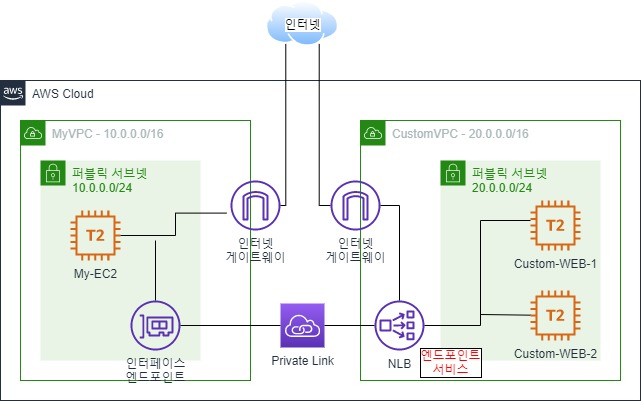

### [해설](https://dev.classmethod.jp/articles/organize-private-links-with-endpoints/)

### 참고
1. 도면과 다르게 VPC2에 서브넷 2개가 구축되어있음.
   1. ALB구축은 서브넷 2개 이상 필요함
   2. NLB구축은 서브넷 1개 이상 필요함
2. 기본 네트워크 환경, 보안그룹, EC2만 구현되어있음.
3. 구현되지 않은 목록
   1. [ ] NLB
   2. [ ] Endpoint
   3. [ ] Endpoint service

### prompt
- 해당 이미지는 ami-01056eaaa603955a4 기준이다.

```text
I need aws cloudformation template. 

It's has two VPC, each VPC is cidr block 10.0.0.0/16 and 20.0.0.0/16. and then each has a public subnet that is 10.0.0.0/24 and 20.0.0.0/24. 
All VPCs have to enable dns host name and dns supports. and then setting for AZ is using !select function.
also each VPCs have a configure, default route and internet gateway and route table, for external internet.

All VPCs have a security group that allow ssh, icmp, http and https.

subnet in VPC1 has a basic EC2 instance that enable webserver and ssh.
subnet in VPC2 has two basic EC2 instance that enable webserver and ssh.

all EC2 instances have that using NetworkInterfaces config set private ip that first available, subnet id, security group, device index, enable public ip. and then ami id is ami-01056eaaa603955a4. and then user data is that 
"
#!/bin/bash
echo "password!" | passwd --stdin root
sed -i "s/^#PermitRootLogin yes/PermitRootLogin yes/g" /etc/ssh/sshd_config
sed -i "s/^PasswordAuthentication no/PasswordAuthentication yes/g" /etc/ssh/sshd_config
systemctl restart sshd

yum update -y
yum install -y httpd.x86_64
systemctl start httpd.service
systemctl enable httpd.service
echo “Hello World from $(hostname -f)” > /var/www/html/index.html
"

VPC2 has target group that includ EC2 instances, has load balancer.

EC2 instance in VPC1 have to connect to load balancer in VPC2 using interface endpoint and private link, endpoint service.
```
