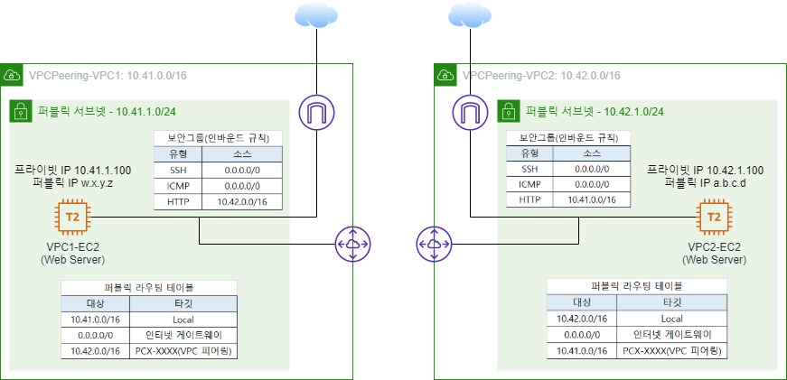

# 01. VPC Peering 개요와 특징

---

- VPC 피어링은 서로 다른 VPC 간의 연결을 구성해서 사설 IP 주소를 통해 서로 통신할 수 있는 환경을 제공한다.
- VPC 피어링을 통해 마치 같은 사설 네트워크에 내에 있는 것처럼 서로 통신할 수 있다.
- 암호화를 통한 보안강화, 고속의 네트워크 망, 비용절감
- 리전 간 VPC 피어링 지원
- 서로 다른 계정 간 VPC 피어링 지원
- 트랜짓 경로를 지원하지 못한다.
- 멀티 VPC 피어링을 지원 못한다.

