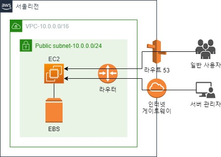

## 가. 구성 시나리오

- 아래 작업 내용을 구현하시오.
- 단기간 한시적으로 운영되는 이벤트 웹사이트이다.
- 사이트 사용자(Client, Admin)는 인터넷을 통해 웹 사이트에 접속한다.
- 접속자가 많지 않아 고사양의 서버는 필요 없다.
- 웹서버는 아파치를 사용한다.
- 다중화 및 이중화(백업)을 고려하지 않는다.

## 나. 구성 포인트

- 리전: 서울
- EC2 인스턴스: 최소한의 웹서버에 적합한 인스턴스
- 웹접속: 탄력적 IP 주소와 도메인을 통해 접속
- 네트워크 구성: 매우 심플하게
- 운영체제 환경: 아마존 리눅스
- [선택] Route53 구성을 제외한 모든 자원에 대한 템플릿(YAML) 파일 생성 및 자동배포
- 참고 자료
  - https://docs.aws.amazon.com/ko_kr/AWSCloudFormation/latest/UserGuide/Welcome.html

