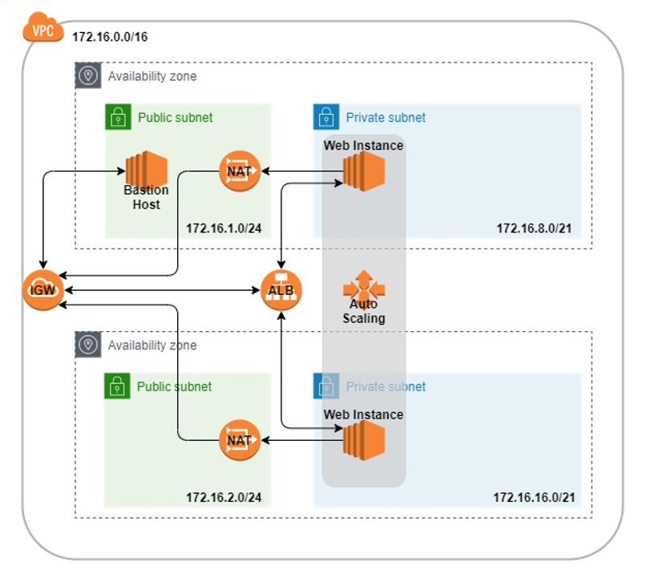

# 01. Auto Scaling 개요

---

- 클라우드 서비스는 필요한 만큼 사용한 자원에 대한 비용을 지불하는 서비스다.
- 서비스 초기에 동시 접속자 10만명 이상의 사용자를 위한 서버를 구입하는 것은 비용 낭비이므로 클라우드 서비스의 확장성을 이용하는 것이 바람직하다.
- 서비스 진행 시점 및 서비스 이용 시간 등을 고려하여 사용량이 많을 때 자원 낭비 없이 서버 자원을 줄이고 늘리는 서비스는 반드시 이용해야 할 기능이다.
- AWS에서는 이러한 확장성을 AWS Auto Scaling 서비스를 통해 제공한다.

# 02. Auto Scaling 종류

---

## 가. 수직 확장(Vertical Scaling)

- 수직 확장은 서버의 성능을 높이는 것이다.
- 인텔 i3 CPU에서 i5로 늘리거나, 디스크 용량을 늘리거나, 컨테이너를 추가하여 고성능화 시키는 확장이다.
- 관리가 쉽다는 장점이 있지만 비용이 기하급수적으로 늘어난다는 단점이 있다.

## 나. 수평 확장(Horizontal Scaling)

- 수평 확장은 서버를 필요한 만큼 여러개 늘리는 것이다.
- 수직 확장보다는 비용이 저렴할 수 있는 반면에 수평 확장이 용이하도록 설계해야 하므로 설계 및 관리가 까다롭다.

