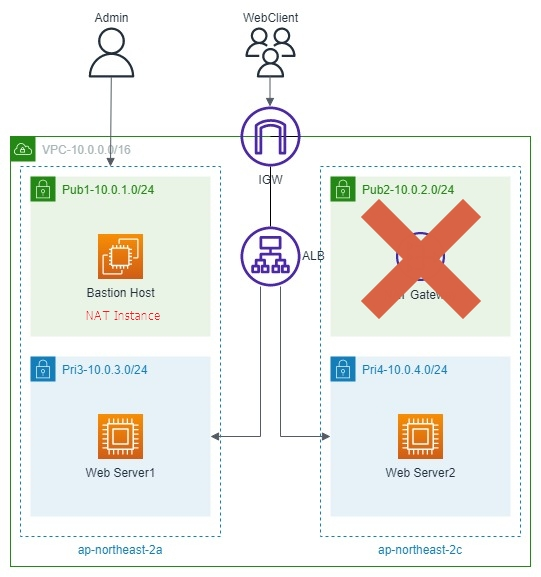

# NAT 디바이스

---

1. NAT 인스턴스와 NAT 게이트웨이를 통칭하여 NAT 디바이스라고 한다.
2. 프라이빗 서브넷의 인스턴스는 공인 IP를 연결할 수 없기 때문에 NAT 디바이스를 사용하여 인터넷 또는 AWS 퍼블릭 서비스에 연결할 수 있다.
3. 기본적으로 내부에서 외부로의 통신만 지원하고 외부에서 내부로의 직접 통신은 불가능하다.

- 원칙적으로는 Route에 NetworkInterfaceId(eni)로 매핑해야하는 것 같은데
- InstanceId 로 설정하니 잘 되었다.