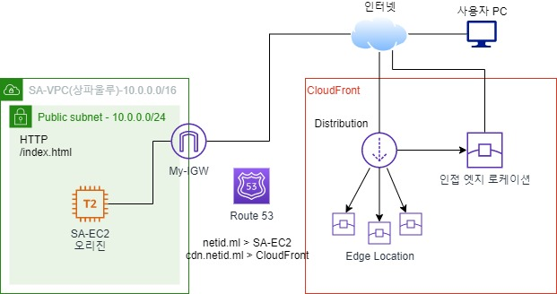

# CDN(Contents Delivery Network)와 CloudFront

---

- 콘텐츠 제공자가 지리적으로 멀리 떨어져 있는 사용자에게 해당 서비스를 빠르게 전달 제공하는 기술이다.
- 대용량 콘텐츠이거나 실시간 스트리밍 형태의 빠른 서비스를 요하는 콘텐츠 전달에 매우 중요한 기술이다.
- 오리진 서버는 지리적으로 멀리 떨어져 있는 사용자들을 위해 캐시 서버를 여러 곳에 분산시켜 콘텐츠를 분배한다.
- CludFront는 AWS 제공하는 CDN 서비스이다.

[웹페이지 접속 속도 확인](https://pagespeed.web.dev/analysis/https-google-com/8rl4l8gstt?hl=ko&form_factor=mobile)