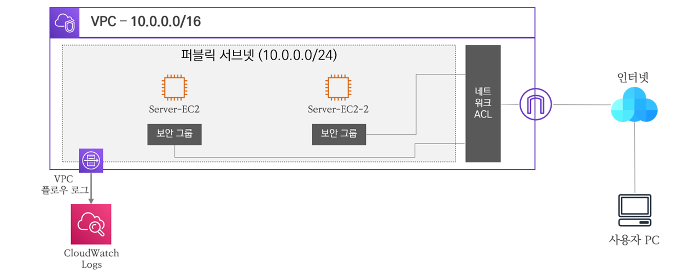

# Security Group & Network ACL
---

# 01. 접근 제어 개요

---

- 일반적으로 접근 제어는 보안상 위협으로부터 제반 시설 및 환경을 보호하기 위한 보안 대책이다.
- 인가된 대상은 접근을 허용하고, 비인가 대상은 접근을 차단하여 보안을 강화한다.
- 식별된 대상에 대한 인증을 수행하여 적합한 대상인지 판단하고, 정책 허용과 거부 등 권한을 부여하여 접근에 대한 제어를 수행한다.
    
    식별(Identity) → 인증(Authentication) → 권한(Authorization)

    
- 접근 대상의 IP 및 프로토콜과 포트 번호를 식별하여 허용 대상은 접근을 허용하고 거부 대상은 접근을 제한한다.

# 02. AWS 보안그룹과 네트워크 ACL

---

- AWS에서는 인프라 보호를 위해 기본적으로 보안 그룹과 네트워크 ACL을 활용한다.
- 보안 그룹과 네트워크 ACL은 IP 주소와 프로토콜 포트 번호를 통해 대상을 식별하고 제어한다.
- 방향에 따라 인바운드 규칙과 아웃바운드 규칙으로 구분된다.
    
- 방향의 기준은 AWS 인프라 기준이다.
- 보안그룹과 네트워크 ACL의 차이점
    - 보안그룹은 인스턴스 레벨의 접근 제어 수행
    - 네트워크 ACL은 서브넷 레벨의 접근 제어 수행
    - 서브넷 네트워크에 대한 접근 제어 정책은 네트워크 ACL
    

# 03. Stateful과 Stateless

---

- Stateful은 이전 상태 정보를 기억하고 있다가 다음 단계에서 그 상태 정보를 활용한다.
- Stateless는 반대로 이전 상태 정보를 기억하지 않아 다음 단계에 관여하지 않는다.
- 보안 그룹은 Stateful 접근 제어이므로 인바운드로 들어오는 트래픽에 대한 인바운드 규칙에 따라 허용하고 기억하여 아웃바운드로 되돌아갈 때 아웃바운드 규칙에 상관없이 허용된다.
    
- 네트워크 ACL은 Statelee 접근 제어이므로 인바운드로 들어오는 트래픽에 대한 인바운드 규칙에 따라 허용하고 상태 정보를 기억하지 않아 아웃바운드에 허용 규칙이 없다면 차단된다.
    

# 04. 허용과 거부 규칙

---

- 보안 그룹은 허용 규칙만 존재한다.
- 나머지는 모두 자동으로 차단한다.

    
- 네트워크 ACL은 허용 규칙과 차단 규칙 모두 존재한다.
- 네트워크 ACL은 규칙을 순차적으로 확인하기 위한 시퀀스 넘버가 존재하며 가장 작은 숫자부터 확인한다.
- 매칭되는 규칙이 있으면 하위 규칙은 확인하지 않는다.
- 맨 마지막 규칙은 모든 트래픽 차단이 자동으로 설정되어 있다.

# 05. 구성

- 보안그룹은 SSH, WWW, ICMP 허용
- NACL은 ssh만 인바운드 허용. 아웃바운드는 모두 허용