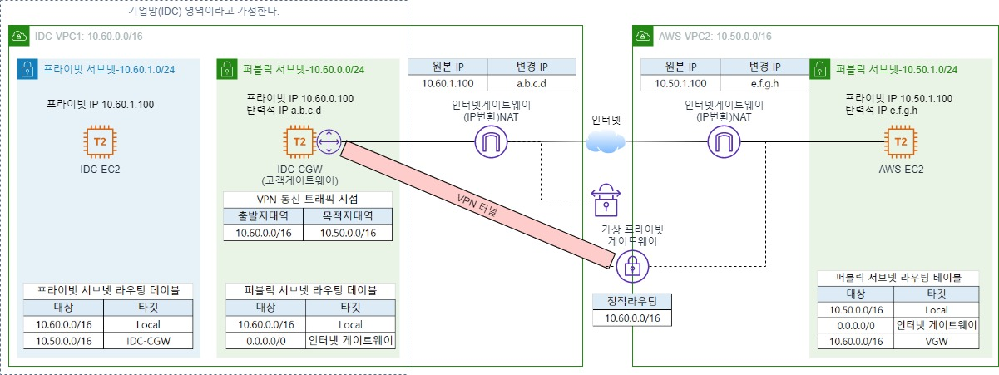

# 01. AWS VPN 개요

---

- VPN은 인터넷을 이용해서 가상 사설 네트워크를 구성하여 프라이빗 통신을 제공한다.
- 데이터 암호화, 전용 연결 등 여러가지 보안 요구사항이 충족되어야 한다.
- AWS VPN은 Site-to-Site VPN과 Client VPN이 있다.

# 02. AWS Site-to-Site VPN

---

- 고가용성 아키텍처 서비스 형태이다.
- 두개의 터널이 고가용성을 위해 서로 다른 가용 영역에 생성된다.
- 각각의 터널을 구성해서 터널 이중화를 구성하는 것을 권장하고 있다.

# 03. 구성도

- openswan으로 구성할 것이고,
- 아래를 참조하여 나머지 환경을 구성한다.

# 04. 참조 url
- [AWS 공식 문서](https://docs.aws.amazon.com/ko_kr/vpn/latest/s2svpn/SetUpVPNConnections.html#vpn-create-vpn-connection)
- [블로그](https://medium.com/petabytz/ipsec-vpn-configuration-on-aws-cloud-using-cloudformation-92078c3aa4c9)

# 05. openswan 구성파일
- 1번은 되어있음.