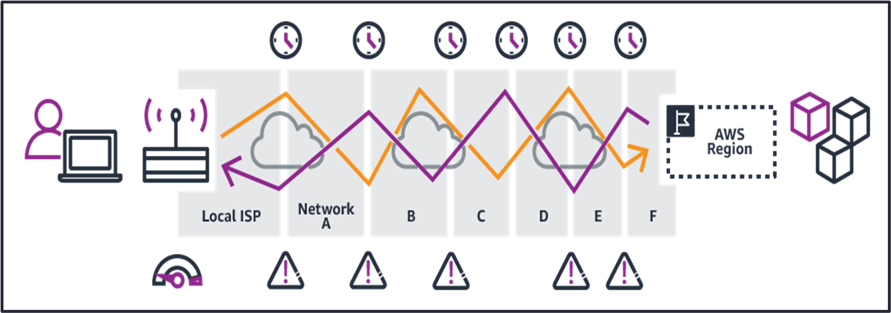
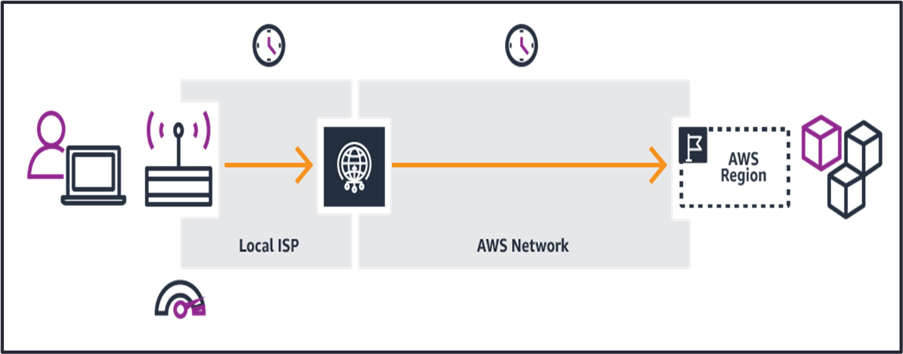
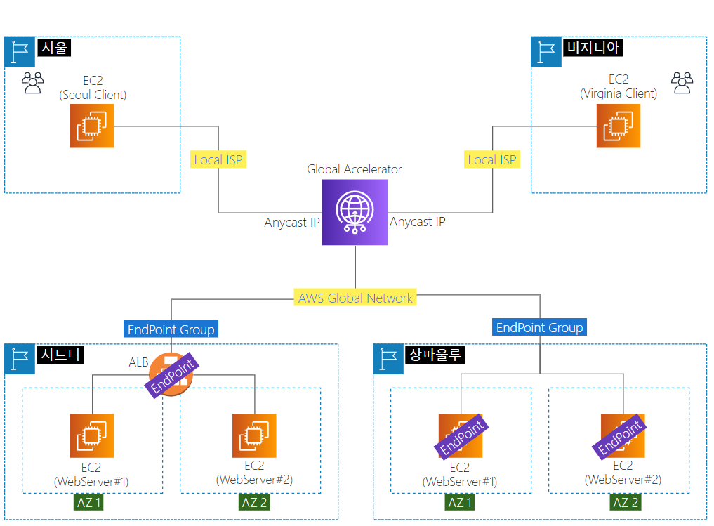
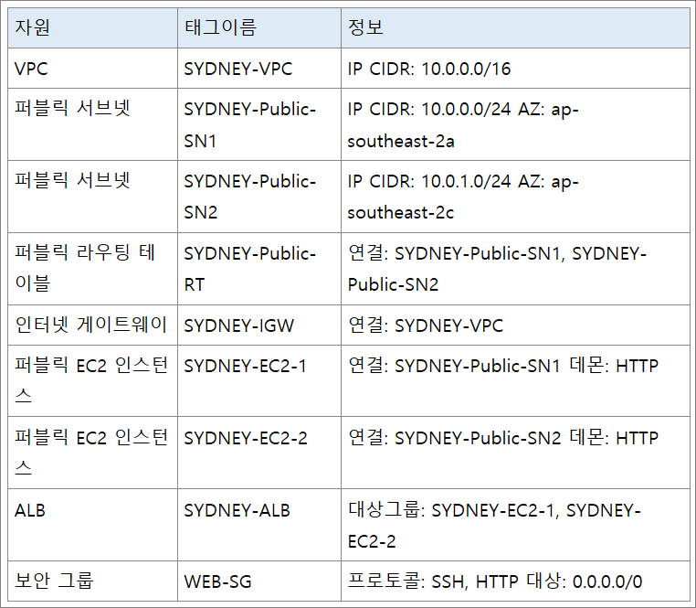
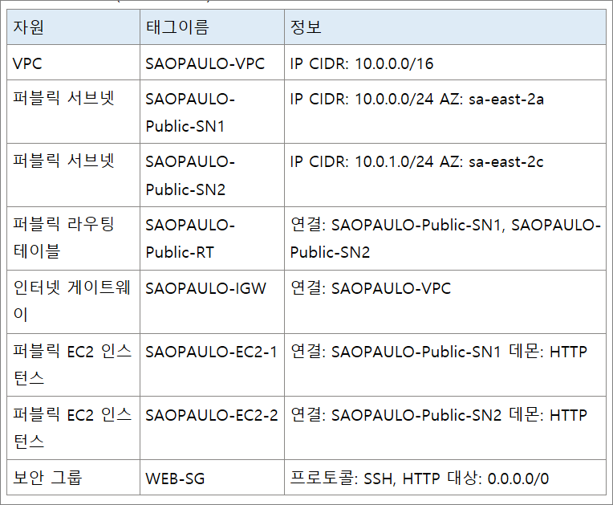
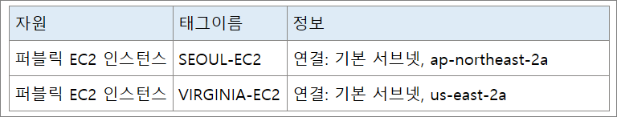

---

# 01. Global Accelerator 개요

---

- 로컬 또는 글로벌 사용자를 대상으로 애플리케이션의 가용성과 성능을 개선하는 서비스이다.
- AWS의 글로벌 네트워크를 통해 사용자에서 애플리케이션으로 이어진 경로를 최적화하여 트래픽의 성능을 개선하는 기술이다.

## 가. Global Accelerator 미적용

- 애플리케이션을 이용하기 위해 수많은 네트워크를 거칠 수 있다.
- 애플리케이션을 오가는 경로가 서로 다를 수 있다.
- 각 홉은 성능에 영향을 주며 위험을 초래할 수 있다.
    
    
    

## 나. Global Accelerator 적용

- AWS Global Accelerator를 추가하면 이러한 비효율성이 사라진다.
- 글로벌 AWS 네트워크를 활용하므로 성능이 개선된다.
    
    
    
- Global Accelerator의 핵심은 애니캐스트(Anycast) IP 주소를 제공하여 사용자 입장에서 가장 인접한 대상으로 접근이 가능하게 하고, AWS 글로벌 네트워크를 경유하여 안정적이고 빠른 서비스를 제공한다.

## 다. Global Accelerator 참고

- [Global Accelerator 개요](https://aws.amazon.com/ko/global-accelerator/?blogs-global-accelerator.sort-by=item.additionalFields.createdDate&blogs-global-accelerator.sort-order=desc&aws-global-accelerator-wn.sort-by=item.additionalFields.postDateTime&aws-global-accelerator-wn.sort-order=desc)
- [Global Accelerator 소개](https://aws.amazon.com/ko/blogs/korea/new-aws-global-accelerator-for-availability-and-performance/)
- [Global Accelerator 사용자 설명서](https://docs.aws.amazon.com/ko_kr/global-accelerator/latest/dg/what-is-global-accelerator.html)

# 02. Global Accelerator 실습 -> 서울리전은 생략한다.

---

- 실습 구성도
    
    
    
- 시드니와 상파울루에 구성된 웹 서버에 대해 Global Accelerator를 통해 연결되는 상태를 확인한다.

## 가. 기본 환경 설정

- 시드니 리전(키페어 생성후 자원 생성한다.)
    
    
    
- 상파울루 리전(키페어 생성후 자원 생성한다.)
    
    
    
- 서울 리전과 버지니어 리전(생략)
    
    