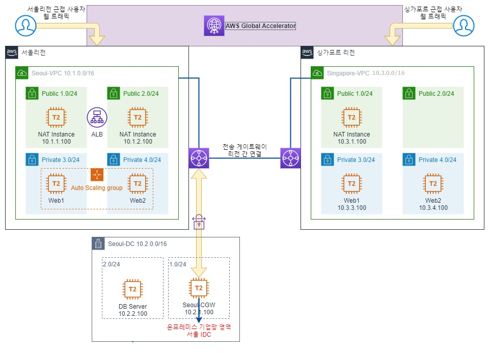
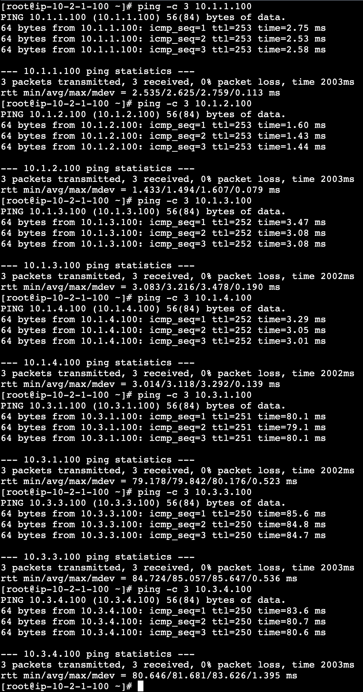

### To DO

- 현재 idc 생성 및 고객 게이트웨이 생성까지 완료

- [x] 해당 대역을 전송 게이트웨이로 라우팅 추가
  - [x] 서울
  - [x] 싱가포르
    - [ ] 📌 싱가포르에는 전송게이트웨이 라우팅테이블에 정적경로가 미리 생성되어있었음. 다음에 전체 테스트 시 해당 내용 확인해봐야 함.
- [x] VPN 연결 생성
  - [x] 해당 고객 게이트웨이
  - [x] 전송 게이트웨이
  - [x] 정적
    - [x] 해당 연결은 tgw 연결 및 tgw 라우팅 테이블에 연결과 전파를 포함하므로 시간이 오래 걸림.
- [x] 구성파일 다운로드 받고 설정
  - [x] right 대역은 축약하여 설정
- [x] 전송게이트웨이 라우팅 테이블에서 해당 대역 정적경로 생성
  - [x] tgw route table id
  - [x] 리소스 유형은 VPN
  - [x] cidr
  - [ ] 📌 경로 생성시 바로 테스트하면 핑이 안될 수도 있으니 시간을 좀 가지고 하면 됨. 
- [x] Global Accelerator 생성

### 구성 방법
1. 1번 파일을 서울 리전에 배포
2. 2번 파일을 싱가포르 리전에 배포
3. 3번 파일을 서울 리전에 배포
   1. 싱가포르 리전에서 반드시 수락을 해야함.
   2. 생각보다 시간이 많이 소요 될 수 있음.
   3. 수락하고 연결이 끝나면 
      1. 3-2번 파일을 양 리전에 배포
4. 4번 파일을 서울리전에 배포
   1. 4-1번 파일로 idc 센터 배포
      1. 고객 게이트웨이까지 배포되어 있음.
   2. ~~4-2번 파일로 각 퍼블릭 라우팅 테이블에 해당 경로와 tgw를 연결~~
      1. ~~양 리전에 각각 배포~~
      2. idc 프라이빗을 제외한 모든 라우팅 테이블에 해당 경로를 설정해주어야 함.
      3. 4-2번 파일을 사용하지 말고,
      4. idc는 nat instance의 eni로,
      5. aws내에서는 tgw로 경로를 설정해 주어야 함.
      6. - [ ] 축약 시 idc 내부 통신 안되는 이유 찾아야함
   3. 4-3번 파일을 서울에 배포하여 vpn 연결 만들기
      1. vpn 연결이 완료되면 해당 구성파일로 구성해야함.
      2. 여기서는 openswan을 사용
      3. 터널이 제대로 up 되는지 확인해야함
      4. 터널2는 안해봄
      5. 구성 시 리모트 대역은 축약하여 사용 함.
         1. 10.0.0.0/8
      ```
      /etc/sysctl.conf
      sysctl -p
      /etc/ipsec.conf
      /etc/ipsec.d/aws.conf
      /etc/ipsec.d/aws.secrets
      ipsec start
      systemctl enable ipsec.service
      systemctl status ipsec.service
      journalctl -xefu ipsec.service
      ```
   4. 4-4번 파일로 위에서 만들어진 tgw attach를 바탕으로 해당 경로를 정적경로로 라우팅 테이블에 등록
      1. 어느 정도 시간이 필요하고
      2. 핑 테스트하면 아래와 같이 네트워킹이 가능함.
      3. 싱가포르쪽이 안된다면 해당 tgw route table에 경로가 안잡혀서 그럴 수 있음.
         1. 그럴땐 같은 tgw로 경로 잡아주면 됨.
   5. 글로벌 엑셀레이터 베포
      1. 리전은 오레곤

