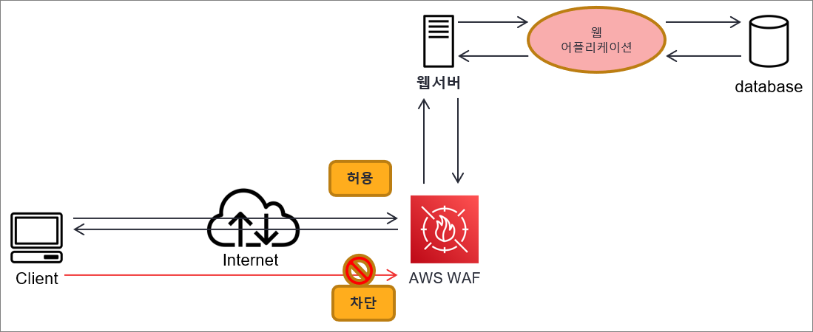
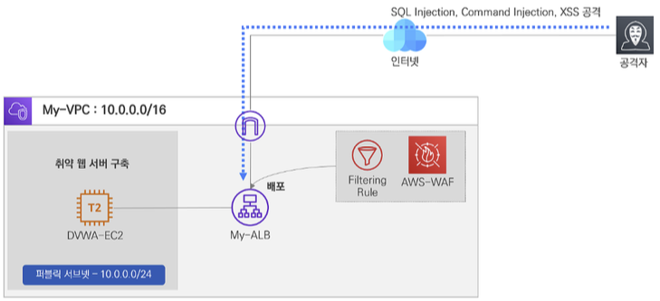
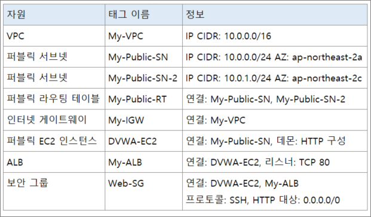
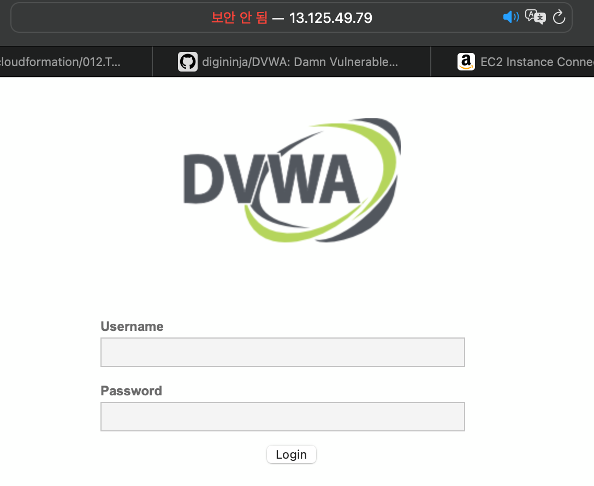
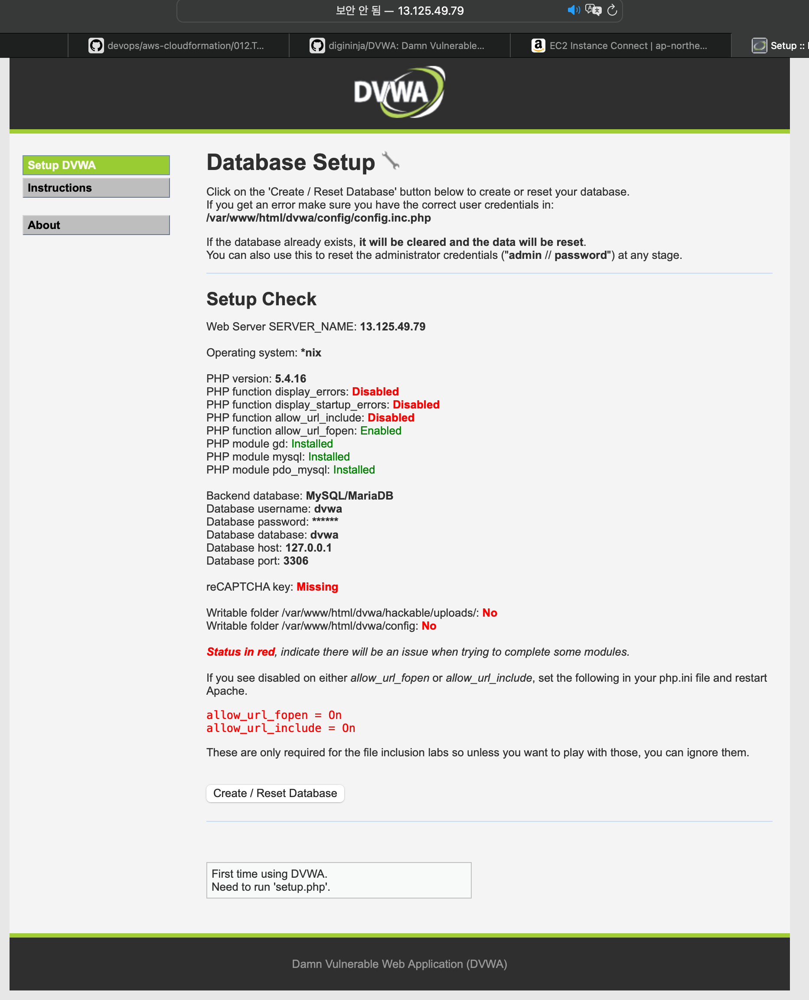

# 01. WAF 개요

---

- Web Application Firewall
- 웹 애플리케이션 보안에 특화된 전용 방화벽이다.
- 웹서비스 취약점에 대한 공격을 탐지하고 차단하는 기능을 수행한다.
- 웹 접근 트래픽에 대한 페이로드 분석 및 패턴 기반의 필터링을 통해 공격을 탐지하고 차단할 수 있다.
    
    
    
- AWS에서 관리하는 웹 애플리케이션 전용 방화벽이다.

# 02. AWS WAF

- AWS WAF는 SQL Injection, XSS 등과 같은 공격 패턴을 차단하는 보안 규칙 및 사용자 정의의 특정 트래픽 패턴을 필터링하는 규칙을 생성할 수 있다.
- AWS WAF를 CloudFront, ALB, API Gateway에 배포할 수 있다.
- 빠른 규칙 생성 및 업데이트를 수행하여 서비스 영향 없이 유연한 구성으로 민첩한 보안 서비스를 제공한다.
- AWS WAF로 트래픽 급증 시 대역폭을 자동으로 확장하여 서비스에 문제없도록 작동한다.
- AWS WAF 초기 구축 비용은 없으며, 사용한 만큼만 비용을 지불한다.
- AWS Firewall Manager를 통해 규칙을 중앙에서 정의 관리하여 유지 관리의 편의성을 제공한다.
- AWS WAF의 모든 기능은 AWS 관리 콘솔 또는 API를 통한 자동화 구성을 할 수 있다.

# 03. AWS WAF 실습

---

- 실습 구성도
    
    
    
- 생성 자원
    
    

- [DVWA](https://github.com/digininja/DVWA)
- db 설정
```
mysql> create database dvwa;
Query OK, 1 row affected (0.00 sec)

mysql> create user dvwa@localhost identified by 'p@ssw0rd';
Query OK, 0 rows affected (0.01 sec)

mysql> grant all on dvwa.* to dvwa@localhost;
Query OK, 0 rows affected (0.01 sec)

mysql> flush privileges;
Query OK, 0 rows affected (0.00 sec)
```
- 
- 