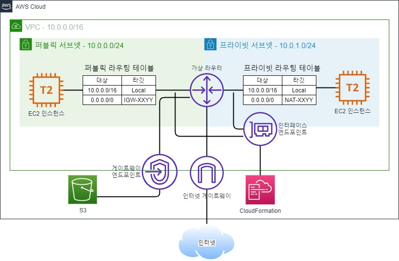

1. EP-VPC 생성
2. EP-IGW 생성
    1. EP-VPC 연결
3. EP-Pub-SN1 생성
4. EP-Pri-SN2 생성
5. EP-Pub-RT1 생성
    1. EP-Pub-SN1 연결
    2. 기본경로: EP-IGW
6. EP-Pri-RT2 생성
    1. EP-Pri-SN2 연결
7. EP-Pub-SG1 생성
    1. SSH, ICMP 허용
8. EP-Pri-SG2 생성
    1. SSH, ICMP 허용
9. EP-Pub-EC2 생성
    1. AZ: ap-northeast-2a
    2. 서브넷: EP-Pub-SN1 
    3. 프라이빗 IP: 10.0.0.100
    4. 퍼블릭 IP: 활성화
    5. 보안그룹: EP-Pub-SG1
10. EP-Pri-EC2 생성
    1. AZ: ap-northeast-2a
    2. 서브넷: EP-Pri-SN2 
    3. 프라이빗 IP: 10.0.1.100
    4. 퍼블릭 IP: 비활성화
    5. 보안그룹: EP-Pri-SG2