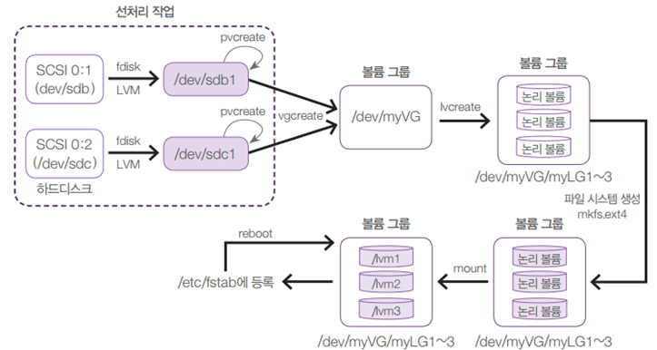
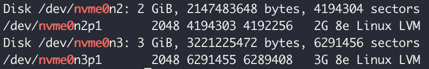
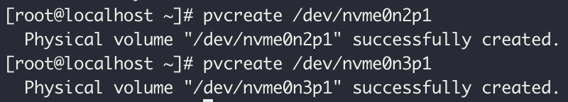
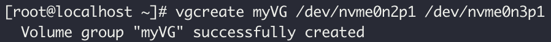
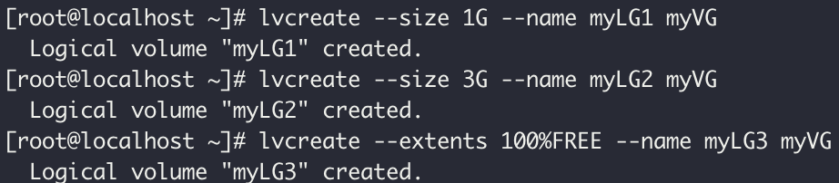
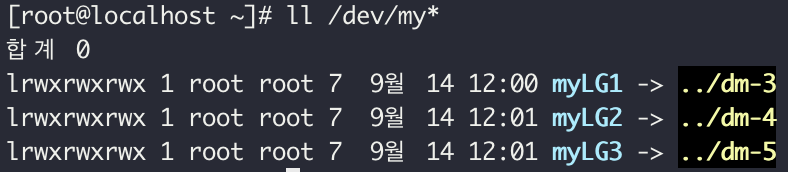
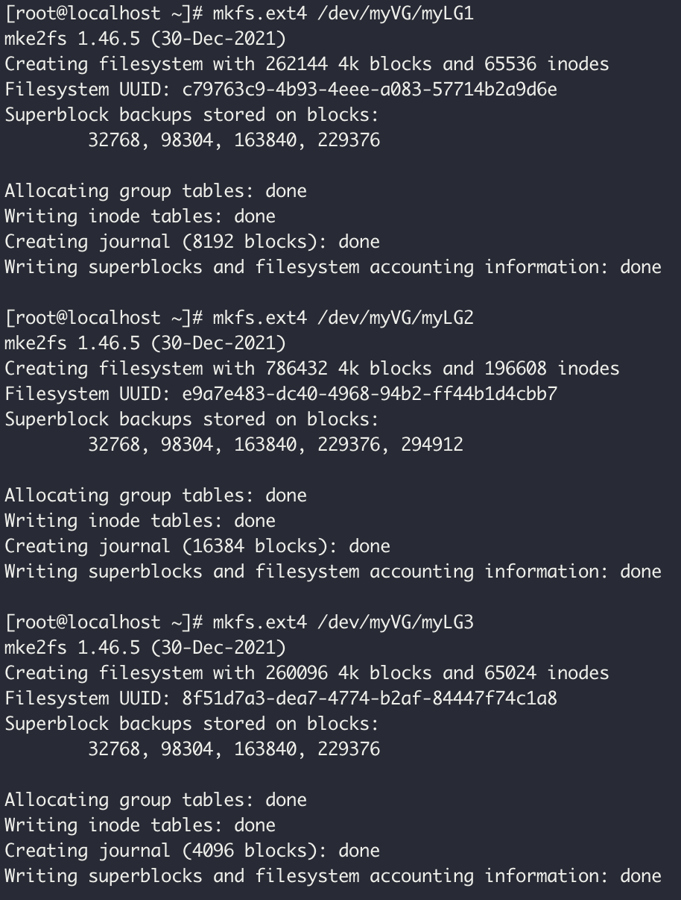
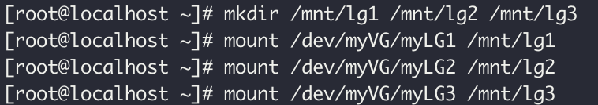
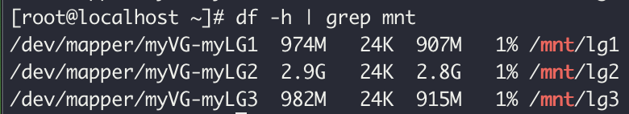
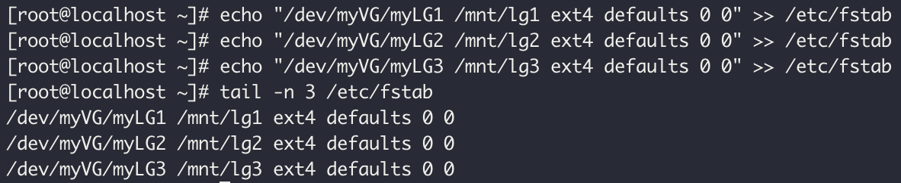

# 01. LVM 개요

---

- LVM(Logical Volume Manage)
- 저장장치를 효율적이고 유연하게 관리하기 위한 커널의 일부와 프로그램이다.
- LVM은 IBM에서 처음 개발하였고, 대부분의 OS(유닉스, 리눅스, 윈도우)에서 이 기능을 제공한다.
- 여러 개의 하드디스크를 합쳐서 한 개의 파일시스템으로 사용하고 필요에 따라서 다시 나눌 수 있다.
- 2TB 용량의 하드디스크 2개를 합친 후에 다시 1TB와 3TB로 나눠서 사용할 수 있다.
- RAID는 한번 파티션을 나누면 파일시스템의 데이터를 유지하면서 파티션 크기를 줄이거나 늘리는 것이 불가능하지만 LVM은 가능하다.

# 02. LVM 용어

---

- PV(Physical Volume, 물리 볼륨): /dev/sda1, /dev/sdb1 등의 파티션
- VG(Volume Group, 볼륨 그룹): 물리 볼륨을 합쳐서 1개의 물리 그룹으로 만드는 것
- LV(Logical Volume, 논리 볼륨): 볼륨 그룹을 1개 이상으로 나눠서 논리 그룹으로 나눈 것

- fdisk

- pvcreate

- vgcreate

- lvcreate

- check

- mkfs

- mount

- mount-check

- fstab
