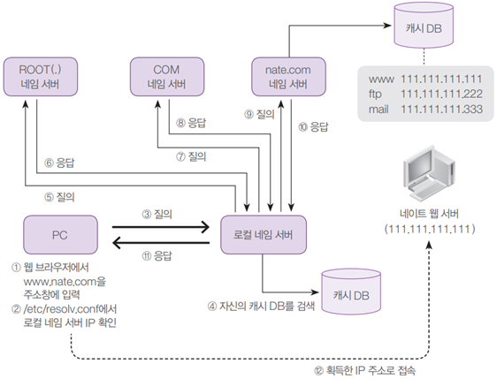
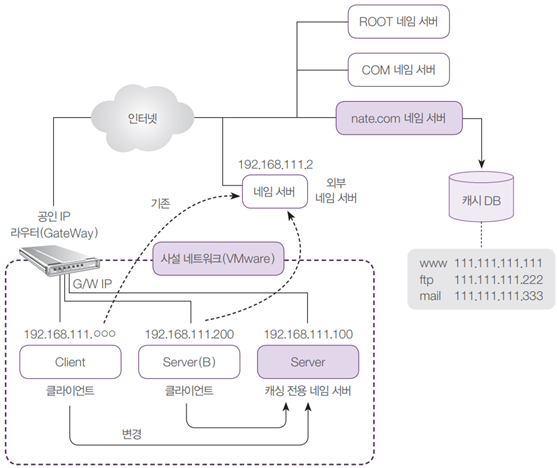
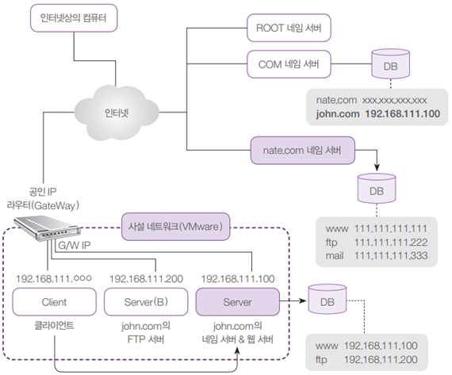

## 로컬 네임 서버

- 로컬 네임 서버가 작동하는 순서
    
    
    
- 로컬 네임 서버는 의외로 아는 것이 별로 없다.
- 로컬 네임 서버가 혼자서 전 세계의 모든 컴퓨터의 도메인 이름을 관리할 수는 없기 때문이다.

## 나. 캐싱 네임 서버와 마스터 네임 서버

- 캐싱 네임 서버는 PC에서 URL로 IP주소를 얻고자 할 때, 해당하는 URL의 IP주소를 알려주는 네임 서버를 말함
    
    
    
- 마스터 네임 서버는 도메인에 속해 있는 컴퓨터들의 이름을 관리하고, 외부에 해당 컴퓨터의 IP주소를 알려주는 역할

    