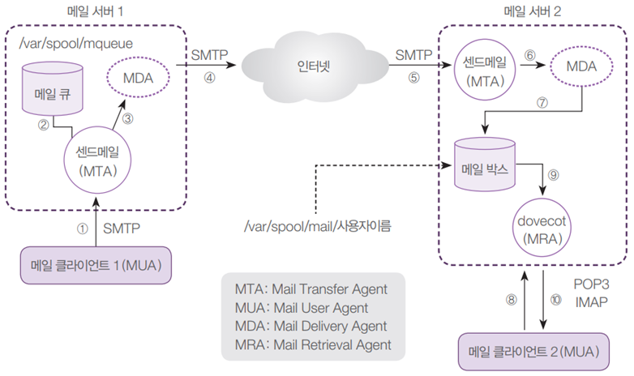

# 01. 메일 서버 개념

---

## 가. E-Mail 프로토콜

- SMTP(Simple Mail Transfer Protocol): 클라이언트가 메일을 보내거나, 메일 서버끼리 메일을 주고 받을 때 사용
- POP3(Post Office Protocol): 메일 서버에 도착되어 있는 메일을 클라이언트로 가져올 때 사용
- IMAP(Internet Mail Access Protocol): POP3와 같음
    
    
    

## 나. E-Mail 서버 동작

- 샌드메일 서버의 자세한 작동 원리
    
    
    
- MTA: 메일 전송 프로세스
- MUA: 메일 사용자 프로세스
- MDA: 메일 배달 프로세스
- MRA: 메일 검색 프로세스

# 02. 메일 서버 실습

---

- 메일 서버 환경 구성도
    
    
    
- 모든 장치 초기화(4대 가상머신 사용)