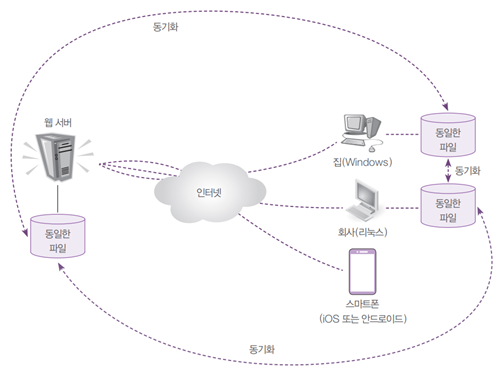

# 클라우드 저장소 개요

---

- 예전에는 웹 브라우저로 접속하여 파일 저장 관리하는 웹하드(Webhard)를 많이 사용했다.
- 요즘은 클라우드 저장소를 더 많이 활용하고 있다.
- 네이버의 N드라이브, 구글 드라이브, MS 원드라이브 등의 서비스를 말한다.
- 클라우드 저장소는 기존의 웹하드 기능까지 포함한다.
- 사용자는 평소대로 집에서 하드디스크에 있는 폴더의 파일을 생성, 수정, 삭제하면 서버 및 회사의 파일이 동기화되어 동일한 파일로 유지된다.
- 스마트폰은 저장 공간이 작으므로 서버의 폴더와 파일을 스마트폰의 파일처럼 리스트로 보여준다.
- 웹하드는 웹 브라우저를 통해 파일을 다운로드해야 하며, 파일을 변경한 후에는 다시 업로드해야 하지만, 클라우드 저장소는 웹 브라우저를 사용할 필요 없이 자연스럽게 자신의 하드디스크에 접근한다.
- 클라우드 서비스 개념도
- 

### 📌 OwnCloud는 php8.x 를 지원하지 않으므로 작동하지 않음.