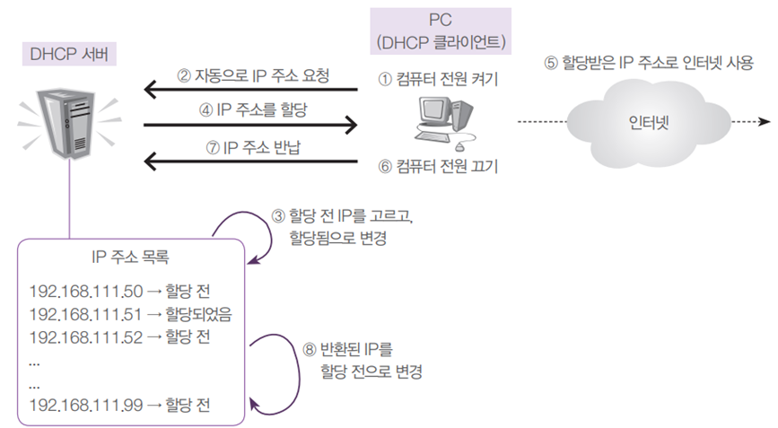
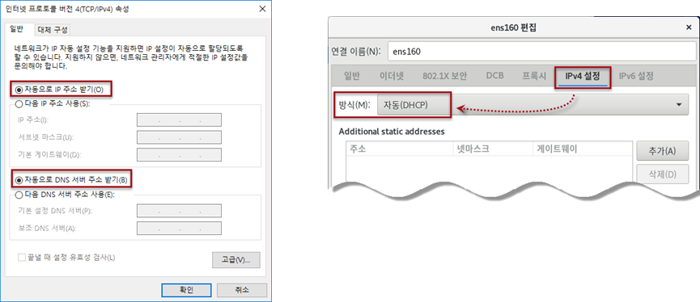

# DHCP 개요와 개념

---

- DHCP(Dynamic Host Configuration Protocol) 서버가 하는 역할은 자신의 네트워크 안에 있는 클라이언트 컴퓨터가 부팅될 때 자동으로 IP주소, 서브넷 마스크, 게이트웨이 주소, DNS 서버 주소를 할당해 주는 것임
- 일반 사용자는 IP에 관련된 어려운 정보를 알지 못해도, 인터넷을 사용하는 데는 더 이상 아무런 문제가 없어짐
- DHCP 서버의 가장 큰 장점은 관리하기 편하고 이용자가 편하다는 것
- 또한 한정된 IP 주소를 가지고 더 많은 IP주소가 있는 것처럼 활용할 수 있음. 즉, 적은 개수의 IP주소로 여러 명의 사용자가 사용할 수 있다는 의미
- DHCP 서버 동작
    
    
    
- DHCP 클라이언트 설정
    
    
    
- 텍스트모드 리눅스에서 DHCP 클라이언트 설정
“/etc/sysconfig/network-scripts/ifcfg-ens32” 파일 수정
BOOTPROTO=dhcp